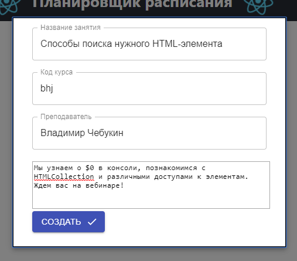
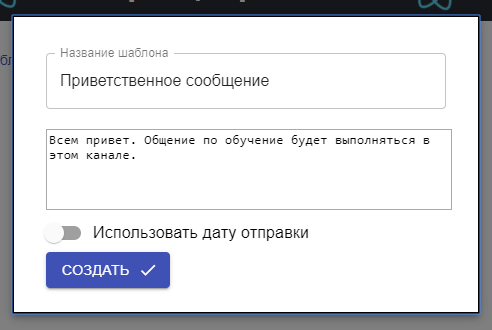
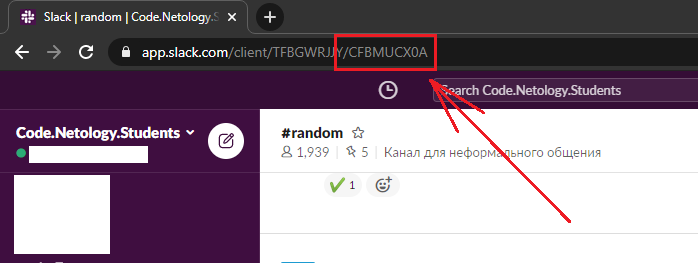

# Инструкция по работе

# Перед началом работы
Перейдите в блок настроек и убедитесь в существовании обязательных изображений.
В случае отсутствия или необходимости замены необходимо добавить следующие файлы:
`лого_logo.png` - имя файла логотипа
`defaultuser_default.jpg` - имя файла для неизвестного пользователя

# Начало работы
Добавьте изображения преподавателей. Профессия преподавателя должна разделяться символом `_`.
Пример:
`Иван Васильевич_Царь.jpg`
`Аль Капоне_Добрый человек.png`

# Создание прикреплённых занятий
На странице "Закрепленные лекции" следует создать занятия, которые прикреплены к определённому лектору.
По клику на кнопку "создать прикреплённое занятие" открывается модальное окно, где необходимо заполнить
* Название занятия
* Код курса (без потока). Тоесть, если поток называется `abc-15`, то код курса будет `abc`
* Имя и фамилия преподавателя
* Обсуждаемые темы и дополнительный текст, который будет печататься в сообщении.

Так же на этой странице можно просматривать и удалять лишние привязанные сообщения.

# Создание шаблонов сообщений
Иногда в чат необходимо отправить сообщение, которое может повторяться: приветствия, прощания, объявления и т.д. Для этого существуют шаблоны сообщений.

По клику на кнопку "создать шаблон сообщения". Для этого шаблон необходимо как-нибудь назвать, и заплонить текст самого сообщения. При необходимости можно установить дату и канал отправки для автоматической отправки сообщения. 

Для использования автоматической отправки сообщения необходимо выбрать канал из возможного списка. Для создания канала необходимо предварительно создать хук для связки с каналом в месседжере.

# Создание хуков
Для того, что бы бот вообще мог отправлять сообщения необходимо создать хук. Для слака хук создаётся в двух местах.
Сначала нужно создать хук в самом приложении слака:
[Хуки факультета программирования](https://api.slack.com/apps/ATB335SQP/incoming-webhooks?)
[Хуки факультета анализа данных](https://api.slack.com/apps/A011XU5KXRV/incoming-webhooks?)
Затем необходимо добавить хук в приложении на странице хуков. Для этого необходимо заполнить:
1. Значение - сам хук (ссылка)
2. Название канала
3. Название учебной группы
4. Идентификатор чата
5. Способ общения (для слака значение `slack`, для телеграмма `telegram`)

Для получения идентификатора чата (канала) необходимо зайти в web версию слака. Зайти в нужный чат и из URL взять последнее значение

Затем **необходимо добавить самого бота в канал** (как пользователя).
Название канала необходимо для команды добавления и переноса пользователей в каналы.

Для создания хука в телеграмме достаточно добавить бота (@R2D2_Scheduler_bot - для факультета программирования / @DSNeto_bot - для факультета аналитики) и ввести команду `/create_hook название_группы`. В таком случае хук автоматически будет создан.

Не забывайте удалять хуки после обучения курса. (в слаке и в приложении). Для удаления хука из телеграмма достаточно ввести команду `/remove_hook`.

После создания хуков можно создавать занятия в расписание

# Создание занятий
На странице "Создать занятие" добавляются занятия. Для этого необходимо заполнить:
* Выбрать группу, из списка хуков, которые были добавлены
* Название занятия
* Время и дата занятия
* Имя и фамилия лектора
* Обсуждаемые темы, которые будут добавлены в анонс. 

Если была создана закреплённая лекция, её можно получить, нажав на кнопку "попробовать получить существующее занятие". Если занятие было создано, то останется только поправить дату и время лекции

В блоке результата сообщения можно получить текст сообщения, которое будет отправлено.

# Страница "расписание занятий"
На странице расписания занятий можно получить список отправленных или неотправленных занятий. Там же можно их моментально отправить, отредактировать (обсуждаемые темы не редактируются) или удалить.

# Страница "отправить"
На странице отправить можно отправить мгновенное сообщение в канал. Можно сформировать сообщение самостоятельно или использовать уже созданный шаблон сообщения.

# Страница "настройки"
На странице настроек можно увидеть статистику о занимаемом месте в базе данных. В том же блоке можно обновить информацию или почистить при нехватке места. В случае очистки данных будут удалены все отправленные анонсы.
В следующем блоке отображаются обязательные изображения (логотип и аватар ненайденного преподавателя).
В последнем блоке загружаются изображения.

Снизу, в аккордеоне отображаются изображения добавленных преподавателей и добавленных фонов.

# Команды ботов
У ботов есть следующие команды
* У слак бота
    * `/addme channel` - добавление канал по его названию. Например `/addme abc-15`
    * `/moveme channel` - перенос пользователя в другой канал (добавление в нужный и удаление из текущего)
* У телеграмм бота
    * `/create_hook group` - создание хука 
    * `/remove_hook` - удаление хука
    * `/when_lesson` - запрос на получение ближайшего сообщения. Для обычных пользователей работает раз в час, остальные запросы банит пользователей на 5 часов.
    * `/forgive` - снимает бан с пользователя. Выполняется на reply сообщения с баном пользователя

В слак боте, для добавления и переноса в канал слак использует идентификатор канала. Поэтому при создании хука необходимо указать правильно идентификатор и название канала (которое будет использоваться в команде).
